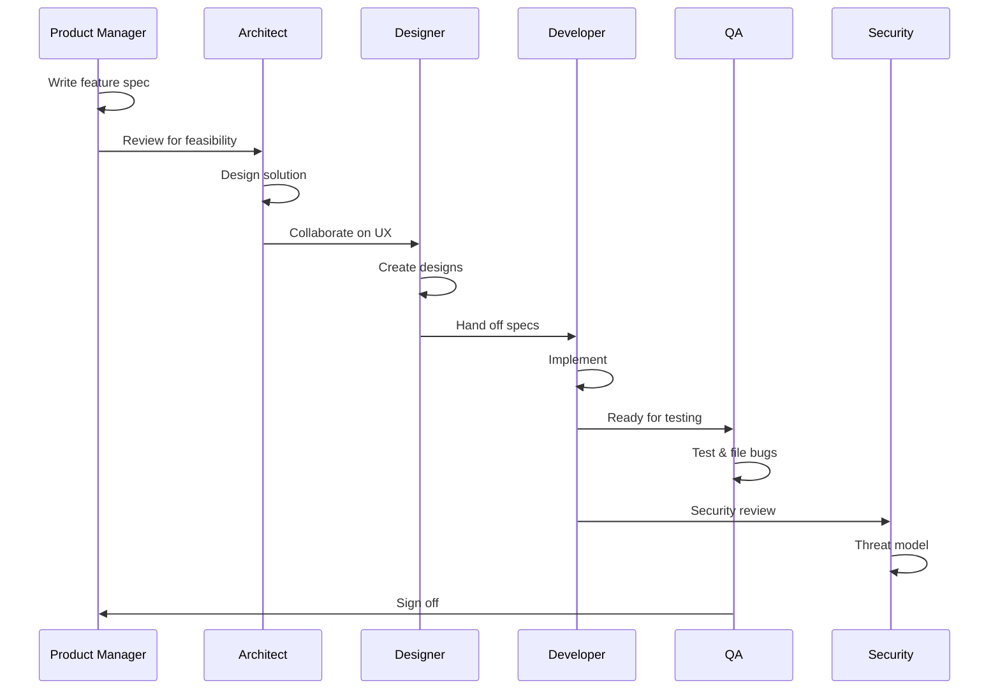

# Agent Orchestration

How the agents collaborate to build great iOS applications.

## Invocation Pattern

When working on a feature, invoke agents using this prompt structure:

```
Acting as the [AGENT NAME] agent (see Agents/[Name]/AGENT.md), 
[your request here]
```

### Example Invocations

```
Acting as the Product Manager agent, write a feature spec for 
weekly meal planning with nutrition tracking.
```

```
Acting as the Security agent, review this authentication flow 
and identify potential vulnerabilities.
```

```
Acting as the QA agent, design test cases for the meal 
creation feature.
```

## Workflow Templates

### 🆕 New Feature Workflow



### 🐛 Bug Fix Workflow

```
1. QA → Detailed bug report
2. Developer → Root cause analysis
3. Developer → Fix implementation  
4. QA → Verify fix
5. Security → Review if security-related
```

### 🔒 Security Review Workflow

```
1. Security → Threat model the feature
2. Security → Review code for vulnerabilities
3. Developer → Implement mitigations
4. Security → Verify mitigations
5. QA → Security test cases
```

## Handoff Documents

### PM → Development Team
- Feature spec with acceptance criteria
- User stories prioritized
- Success metrics defined

### Architect → Developer
- Architecture Decision Record (ADR)
- Module design doc
- API contracts

### Designer → Developer
- Screen mockups with specs
- Component library reference
- Animation specifications
- Accessibility requirements

### Developer → QA
- PR/code ready for testing
- Known limitations
- Test environment setup

### QA → Everyone
- Test results
- Bug reports
- Risk assessment

## Multi-Agent Collaboration Prompts

### Design Review
```
I need a cross-functional review of this feature:

1. Acting as the Product Manager: Does this meet user needs?
2. Acting as the Architect: Is this technically sound?
3. Acting as the Designer: Is the UX optimal?
4. Acting as the Security agent: What are the risks?
```

### Code Review
```
Review this code from multiple perspectives:

1. Acting as the Developer: Is this clean, idiomatic Swift?
2. Acting as the QA agent: Is this testable? What should we test?
3. Acting as the Security agent: Any vulnerabilities?
```

### Pre-Launch Checklist
```
Acting as each agent, confirm readiness for launch:

1. PM: Are acceptance criteria met?
2. Architect: Is the code maintainable?
3. Designer: Does UX match specs?
4. Developer: Are there known issues?
5. QA: What's the test coverage?
6. Security: Are there open vulnerabilities?
```

## Context Files

Agents should reference these shared documents:

| File | Purpose | Updated By |
|------|---------|------------|
| `Docs/VISION.md` | Product vision and goals | PM |
| `Docs/ARCHITECTURE.md` | Technical decisions | Architect |
| `Docs/ROADMAP.md` | Feature priorities | PM |
| `Docs/DESIGN_SYSTEM.md` | UI components | Designer |
| `Docs/SECURITY.md` | Security requirements | Security |

## Best Practices

1. **Start with PM** - Features without specs drift
2. **Architect early** - Redesign is expensive
3. **Security by design** - Bolt-on security fails
4. **QA throughout** - Not just at the end
5. **Document decisions** - Future you will thank you

## Conflict Resolution

When agents disagree:

1. **User value wins** - What's best for the user?
2. **Data decides** - Can we test the hypothesis?
3. **Ship and learn** - Perfect is the enemy of good
4. **PM breaks ties** - Someone has to decide
